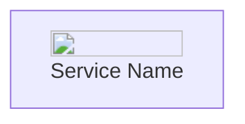

# Enhancing AWS Architecture Diagrams with Images and Data Mining

## Approach

1. Use a diagram-as-code tool that supports custom node styling (e.g., Mermaid, PlantUML, or D2)
2. Integrate AWS service icons into node definitions
3. Implement a data mining process to extract relevant information
4. Automatically update diagrams based on mined data

## Step 1: Choose a Diagram-as-Code Tool

Mermaid is a popular choice and has good support for custom node styling. Here's how you might define a node with an image in Mermaid:



## Step 2: Integrate AWS Service Icons

Using the JSON data you provided, we can create a mapping function to automatically insert the correct icon URL for each AWS service. Here's a Python example:

```python
import json

with open('aws_icons.json', 'r') as f:
    aws_icons = json.load(f)

def get_node_definition(service_name):
    icon_url = aws_icons.get(service_name.lower(), '')
    return f"{service_name}[ {service_name}]"

# Usage
s3_node = get_node_definition('s3')
lambda_node = get_node_definition('lambda')
```

## Step 3: Implement Data Mining

Develop a data mining process that extracts relevant information from your AWS environment. This could involve:

- Using AWS CLI or SDK to query your AWS resources
- Parsing CloudFormation templates or Terraform state files
- Analyzing CloudTrail logs or AWS Config data

## Step 4: Automatically Update Diagrams

Create a script that combines the data mining results with the diagram generation:

1. Run the data mining process to get current AWS resource information
2. Generate node definitions using the `get_node_definition` function
3. Create connections between nodes based on the mined data
4. Output the complete diagram code

Here's a basic example:

```python
def generate_diagram(resources, connections):
    diagram = "graph TD\n"
    for resource in resources:
        diagram += f"    {get_node_definition(resource)}\n"
    for source, target in connections:
        diagram += f"    {source} --> {target}\n"
    return diagram

# Usage
resources = ['s3', 'lambda', 'dynamodb']
connections = [('s3', 'lambda'), ('lambda', 'dynamodb')]
diagram_code = generate_diagram(resources, connections)
print(diagram_code)
```

This approach allows you to automatically generate up-to-date AWS architecture diagrams with service icons, based on your actual AWS environment data.
